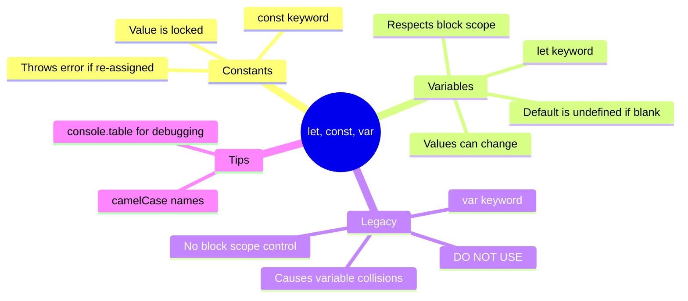

```mermaid
mindmap
  root((let, const, var))
    Constants
      ::icon(fa fa-lock)
      const keyword
      Value is locked
      Throws error if re-assigned
    Variables
      ::icon(fa fa-edit)
      let keyword
      Values can change
      Respects block scope
      Default is undefined if blank
    Legacy
      ::icon(fa fa-exclamation-triangle)
      var keyword
      DO NOT USE
      No block scope control
      Causes variable collisions
    Tips
      ::icon(fa fa-lightbulb)
      camelCase names
      console.table for debugging
```
