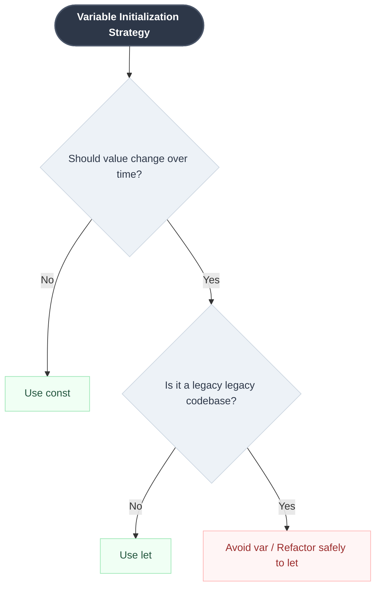

# 🍵 Chai aur JavaScript | Notes & Exercises

Welcome to my personal learning repository for the **"Chai aur JavaScript"** series by Hitesh Choudhary. This repository contains structured code examples, deep-dive architectural notes, and visual mindmaps tracking my progress from syntax fundamentals to real-world deployment practices.

---

## 📂 Repository Index

| File / Folder Name | Description | Status |
| :--- | :--- | :---: |
| [`01_let_const_var.js`](#) | Hands-on code files exploring scope behavior and re-assignment errors. | ✅ Complete |
| [`README.md`](./README.md) | Centralized index, architectural blueprints, and quick-reference syntax notes. | 📖 Reading |

---

## 🧠 Core Architecture Mindmap

GitHub natively renders the concept mapping below to break down the primary structural differences between declaration types discussed in the lecture:

```mermaid
mindmap
  root((let, const, var))
    Constants
      const keyword
      Value is structurally locked
      Throws assignment error if re-assigned
    Variables
      let keyword
      Values can change dynamically
      Strictly respects block scope {}
      Defaults to undefined if unassigned
    Legacy
      var keyword
      🚫 DO NOT USE ANYMORE
      Lacks block scope control
      Causes stealth variable collisions
    Best Practices
      camelCase naming conventions
      console.table for array debugging
```

---

## 📝 Lecture Blueprint: Variables & Constants

### 1. Variables and Constants Definitions
* **`const`**: Use when a value must remain immutable throughout execution. 
* **`let`**: Use as the modern default for any value that must change or re-initialize.
* **`var`**: Legacy pointer keyword. Intentionally excluded from modern software pipelines.

### 2. The Legacy Scoping Issue (`var` vs `let`)
Historically, `var` failed to isolate variables inside block containers (`{}`). If a dynamic loop or local condition initialized a variable name that matched a global identifier, it would silently rewrite data downstream. Modern engines resolve this systemic leakage by utilizing block-scoped `let` and `const`.

> ⚠️ **Standard Operating Directive:** Prefer **not** to use `var` due to systemic instability in block and functional scopes.

---

## 🚀 Practical Blueprints

### Decision Architecture
Use the logical routing workflow below to dynamically pick the correct declaration pattern during feature construction:



### Reference Code Implementations

```javascript
// Strict Initialization Sequence
const accountId = 144553;            // Value structurally locked
let accountEmail = "hitesh@hc.com";  // Mutable pointer allocation
var accountPassword = "12345";       // Legacy token - Avoid active use

// Runtime Re-assignment Operations
accountEmail = "developer@hc.com";
accountPassword = "secure_string";

// accountId = 999999; // ❌ Throws Type Error: Assignment to constant variable.

// Memory Allocation Without Explicit Assignment
let accountState; 
console.log(accountState); // Outputs: undefined
```

### Advanced Debugging: Tabular Layout Display
Avoid terminal cluttering from stacked standalone log functions by flattening elements into uniform array structures via `console.table()`:

```javascript
// Clean multi-variable profiling block
console.table([accountId, accountEmail, accountPassword, accountState]);
```

---

## 🔗 Project Links & Materials
* **Course Resource Hub:** [Chai Code Community Portal](https://chaicode.com)
* **Official Code Base:** [hiteshchoudhary/js-hindi-youtube](https://github.com)
